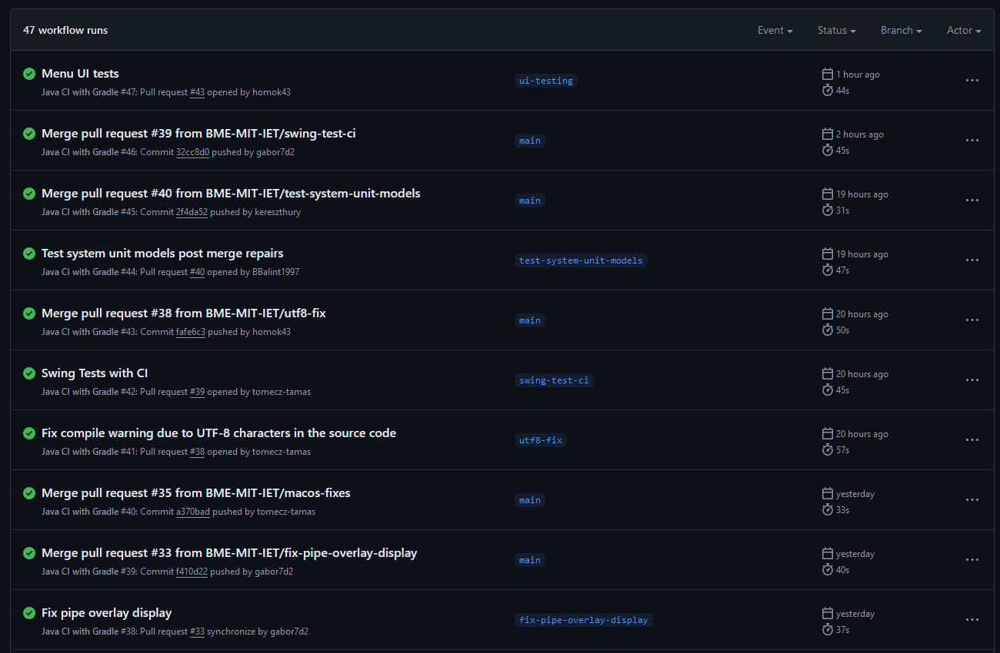

## Feladat: Build keretrendszer beüzemelése, CI beüzemelése

A Gradle és a GitHub Actions használata a projektben leegyszerűsíti a forráskód fordítását és az üzembe helyezési folyamatot, biztosítva a kódmódosítások automatikus tesztelését és érvényesítését.

A Gradle megkönnyíti a függőségek kezelését és a kód fordítását. A build.gradle fájl határozza meg a projekt konfigurációját, beleértve a beépülő modulokat, függőségeket és feladatokat. Ez a fájl a projekt összeállítási folyamatának alapját képezi, biztosítva a konzisztenciát a különböző környezetekben. Továbbá tartalmazza a tesztelési környezet beállításait JUnit-al és JaCoCo-val. Az utóbbi felelős a tesz lefedettség méréséért.

A GitHub Actions tovább fejleszti ezt a beállítást a folyamatos integráció (CI) folyamatának automatizálásával. A GitHub repo-ban található egy munkafolyamat-fájl (.github/workflows/gradle.yml), amely YAML-formátumban leírja a CI-folyamat lépéseit. Ez magában foglalja a megfelelő JDK-környezet beállítását és a Gradle-parancsok, például a ./gradlew build végrehajtását. A GitHub Actions lehetővé teszi, hogy minden push vagy pull request automatikusan elindítsa a meghatározott munkafolyamatot, futtatva a teszteket és buildeket, azonnali visszajelzést adva a kód minőségéről és az integráció állapotáról.

### Fő feladat issue: [Configure build framework & CI #36](https://github.com/gabor7d2/iet-hf-2024-macaroni/issues/36)

### Dolgozott rajta:
- tomecz-tamas
  - issue: [Configure Gradle build for project #2](https://github.com/gabor7d2/iet-hf-2024-macaroni/issues/2)
  - PR: [Create gradle buildscript #4](https://github.com/gabor7d2/iet-hf-2024-macaroni/pull/4)
    - reviewer: gabor7d2
  - issue: [Configure Github Actions CI for project #3](https://github.com/gabor7d2/iet-hf-2024-macaroni/issues/3)
  - PR: [Setup Github Actions #5](https://github.com/gabor7d2/iet-hf-2024-macaroni/pull/5)
    - reviewer: gabor7d2

A Gradle és a CI beüzemelése megkönnyítette a Pull Requestek ellenőrzését, és a tesztek futtatását.
