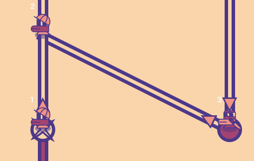

## Feladat: Manuális tesztek megtervezése, végrehajtása és dokumentálása vagy exploratory testing

Exploratory testing keretében játszottunk a játékkal, közben **minél több különböző lehetséges cselekvéssorozatot és pályát kipróbáltunk**. A talált hibákhoz felvettünk issue-t GitHub-on, majd kijavítottuk őket.

### Fő feladat issue: [Exploratory testing #25](https://github.com/BME-MIT-IET/iet-hf-2024-macaroni/issues/25)

### Dolgozott rajta:
- gabor7d2
- kereszthury

#### Ezeket az issue-kat vettük fel és javítottuk ki:
- [MacOS issues #26](https://github.com/BME-MIT-IET/iet-hf-2024-macaroni/issues/26)
  - induláskor exception-t dobott macOS-en a játék, mivel a mac specifikus .DS_Store fájlt is be próbálta tölteni fontként.
  - fullscreen mód nem működött megfelően, a dock és a menu bar a képernyőn maradt és kitakarta a játékot.
  - PR: [Macos fixes #35](https://github.com/BME-MIT-IET/iet-hf-2024-macaroni/pull/35)
    - dolgozott rajta: gabor7d2
    - ellenőrizte: tomecz-tamas
- [Relocate maps #27](https://github.com/BME-MIT-IET/iet-hf-2024-macaroni/issues/27)
  - a pályák kezdőpozíciója nem volt megfelelő, belelógtak a bal oldali vezérlőpanel alá.
  - PR: [Map scaling based on resolution #32](https://github.com/BME-MIT-IET/iet-hf-2024-macaroni/pull/32)
    - dolgozott rajta: kereszthury
    - ellenőrizte: gabor7d2
- [Cannot step on broken pipe as engineer with banana effect applied on it #29](https://github.com/BME-MIT-IET/iet-hf-2024-macaroni/issues/29)
  - azt tapasztaltuk, hogy egy banán effektes csőre nem lehet rálépni. a modell specifikáció szerint működött, a frontend-en kellett javításokat végezni.
  - PR: [Fix moving to pipe with banana effect #34](https://github.com/BME-MIT-IET/iet-hf-2024-macaroni/pull/34)
      - dolgozott rajta: gabor7d2
      - ellenőrizte: kereszthury
- [Cistern spawns pipes under existing ones #30](https://github.com/BME-MIT-IET/iet-hf-2024-macaroni/issues/30)
  - a ciszterna amikor random csövet spawnol magához, akkor azt egy random elfordulással teszi, így van, amikor átfedésbe kerül másik csövekkel. ezt lehetne szebben megcsinálni, hogy amíg van hely, addig ne átfedve spawnoljon, és ha elfogyott a hely, akkor ne spawnoljon többet. Ezt az issue-t nem volt időnk kijavítani.
- [Pipe effects not updated on move #31](https://github.com/BME-MIT-IET/iet-hf-2024-macaroni/issues/31)
  - azt tapasztaltuk, hogy a csövön levő effektek, illetve a pumpa ki-bemeneti háromszögei nem frissülnek miközben egy szerelő egy cső egyik végét magával viszi.
  - javítás előtt:
    - 
  - javítás után:
    - 
  - PR: [Fix pipe overlay display #33](https://github.com/BME-MIT-IET/iet-hf-2024-macaroni/pull/33)
      - dolgozott rajta: kereszthury
      - ellenőrizte: gabor7d2

Ez a feladat hasznos volt a szoftver minőségének javítása kapcsán, olyan problémákat is fel lehetett vele deríteni amiket unit tesztekkel, UI tesztekkel nehéz vagy lehetetlen lenne.
