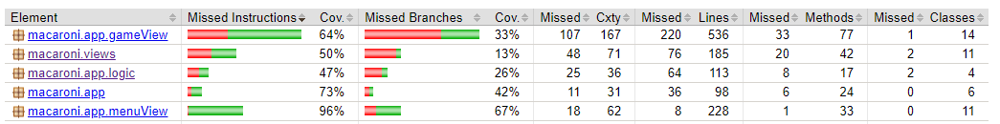

## Feladat: UI tesztek készítése

Hasznos felállítani egy automatizált UI tesztrendszert, mert a tesztek minden futtatásnál ugyanazt az inputot adják az
alkalmazásnak, ami emberileg közel lehetetlen.
A feladathoz a Swing UI támogatással rendelkező az **AssertJ** keretrendszert választottuk, ami a **JUnit**
egységtesztjeibe épül be.

Az alkalmazás menüjét és részben a játék nézetét teszteltük egységtesztekkel, illetve egy hosszabb és átfogóbb teszttel,
amikben felvesszük a két csapat játékosainak neveit, kiválasztjuk a pályát és elindítjuk a játékot.

Asztali környezetben a tesztrendszer az egeret mozgatva és billentyűket lenyomva navigál a UI-ban, de nem nehéz CI
rendszerbe sem integrálni.
Ki is egészítettük a GitHubos CI rendszerünket, hogy ezeket a teszteket is helyesen futtassa.

### Fő feladat issue: [UI Testing #37](https://github.com/BME-MIT-IET/iet-hf-2024-macaroni/issues/37)

### Dolgozott rajta:

- homok43
    - PR: [Menu UI tests #43](https://github.com/BME-MIT-IET/iet-hf-2024-macaroni/pull/43)
        - reviewer: gabor7d2
- tomecz-tamas
    - PR: [Swing Tests with CI #39](https://github.com/BME-MIT-IET/iet-hf-2024-macaroni/pull/39)
        - reviewer: gabor7d2

Megállapítottuk, hogy a UI elemek jól működnek több fajta bevitelre is,
és most már fontosabbnak tartjuk a UI gépi tesztelését.

Code coverage a UI package-eiben:

