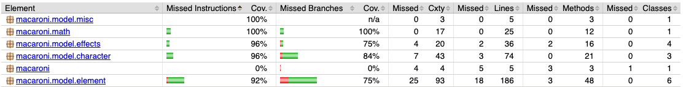

## Feladat: Egységtesztek készítése/kiegészítése + tesztek kódlefedettségének mérése és ez alapján tesztkészlet bővítése

A projekt tartalmazott egy egyedi teszt keretrendszert, illetve teszteket. Ezek a tesztek több ok miatt sem ideálisak:
- **egyrészt nem standard teszt keretrendszer**, így új, a projekten dolgozó embereknek nem lesz rögtön magától értetődő, mi hogyan működik
- **másrészt**, ami a nagyobb probléma, hogy ez a teszter **reflection-nel tesztel**, ami erősen sérti a unit tesztelés fogalmát, mivel a belső működést, állapotokat is mind nézi, és a kód bővíthetőségét is erősen korlátozza, ugyanis ha valamilyen változót átnevez valaki a modellben, pár teszt sikertelen lesz.

Ezt az egyedi tesztert cseréltük le egy standard megoldásra: **JUnit tesztekre**. A feladat magában foglalta a régi, egyedi teszterhez készített tesztek átmigrálását JUnit-ba, ezenkívül a modellhez unit tesztek készítését, ami **mockito segítségével** egyszerre csak egy kis szeletét (ideálisan egy osztály egy függvényét) teszteli a modellnek. Erre azért volt szükség, mivel az alap tesztek objektumok közötti interakciót tesztelnek, ebben a projektben a modell részei erősen függnek egymástól, így fontosnak tartottuk, hogy **izolálva is le legyenek tesztelve a modell osztályok**.

**Kódlefedettséget JaCoCo segítségével néztük**, és amelyik osztálynak nem volt 100%-os a kódlefedettsége, ahhoz **új teszteket is felvettünk**. 

Ezenkívül a Github CI-t is kiegészítettük, hogy a teszteket futtassa le minden pull request létrehozásakor, illetve committoláskor.

### Fő feladat issue: [Unit testing #6](https://github.com/BME-MIT-IET/iet-hf-2024-macaroni/issues/6)

### Dolgozott rajta:
- BBalint1997
  - issue: [Create unit tests for model classes #8](https://github.com/BME-MIT-IET/iet-hf-2024-macaroni/issues/8)
  - PR: [Test system unit models post merge repairs #40](https://github.com/BME-MIT-IET/iet-hf-2024-macaroni/pull/40)
    - reviewer: kereszthury
- gabor7d2
  - issue: [Convert old Attach-Detach Actions tests to JUnit #21](https://github.com/BME-MIT-IET/iet-hf-2024-macaroni/issues/21)
  - PR: [Test attach detach actions #22](https://github.com/BME-MIT-IET/iet-hf-2024-macaroni/pull/22)
    - reviewer: tomecz-tamas
- homok43
  - issue: [Convert old Character Move tests to JUnit tests #10](https://github.com/BME-MIT-IET/iet-hf-2024-macaroni/issues/10)
  - PR: [Character Move tests #16](https://github.com/BME-MIT-IET/iet-hf-2024-macaroni/pull/16)
    - reviewer: kereszthury
- kereszthury
  - issue: [Convert old ControllerActions and Element Tick tests to JUnit #11](https://github.com/BME-MIT-IET/iet-hf-2024-macaroni/issues/11)
  - PR: [Controller Actions & Element ticks tests #14](https://github.com/BME-MIT-IET/iet-hf-2024-macaroni/pull/14)
    - reviewer: homok43
- tomecz-tamas
  - issue: [Convert old Basic Actions tests to JUnit tests #41](https://github.com/BME-MIT-IET/iet-hf-2024-macaroni/issues/41)
  - PR: [Add basic actions tests #28](https://github.com/BME-MIT-IET/iet-hf-2024-macaroni/pull/28)
    - reviewer: homok43
  - PR: [Setup JUnit, Mockito and JaCoCo coverage #7](https://github.com/BME-MIT-IET/iet-hf-2024-macaroni/pull/7)
    - reviewer: kereszthury

A unit tesztek segítségével megbizonyosodhatunk arról, hogy jól működik a program. Ez nagy segítség lesz, ha a későbbiekben a kódon változtatásokat akarunk eszközölni.

Code coverage a modell package-ben:

